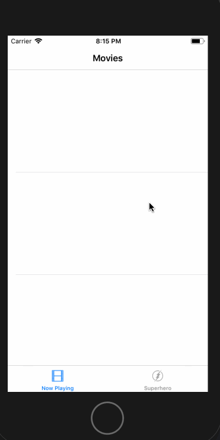
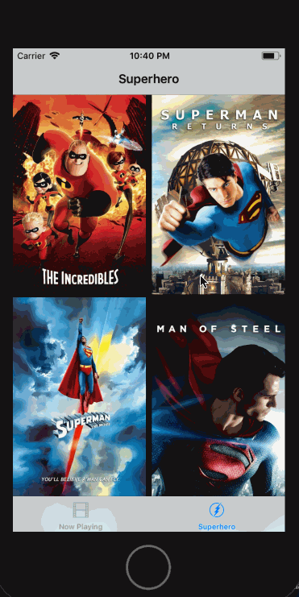

# Flixapp
Flix is an app that allows users to browse movies from the [The Movie Database API](https://developers.themoviedb.org/3).

## Flix Part 2

### User Stories

#### REQUIRED (10pts)
- [x] (5pts) User can tap a cell to see more details about a particular movie.
- [x] (5pts) User can tap a tab bar button to view a grid layout of Movie Posters using a CollectionView.

#### BONUS
- [x] (2pts) User can tap a poster in the collection view to see a detail screen of that movie.
- [ ] (2pts) In the detail view, when the user taps the poster, a new screen is presented modally where they can view the trailer.

### App Walkthough GIF

GIF created with [LiceCap](http://www.cockos.com/licecap/).

### Notes
Describe any challenges encountered while building the app.

---

## Flix Part 1

### User Stories

#### REQUIRED (10pts)
- [x] (2pts) User sees an app icon on the home screen and a styled launch screen.
- [x] (5pts) User can view and scroll through a list of movies now playing in theaters.
- [x] (3pts) User can view the movie poster image for each movie.

#### BONUS
- [ ] (2pt) User can view the app on various device sizes and orientations.
- [x] (1pt) Run your app on a real device.

### App Walkthough GIF

GIF created with [LiceCap](http://www.cockos.com/licecap/).
### Notes
Attempted the bonus for allowing users to view the app on various devices. I added constraints to the Table View so that the height and width adjusted depending on the device. When adding constraints to the labels/imageView, they begin to overlap.

